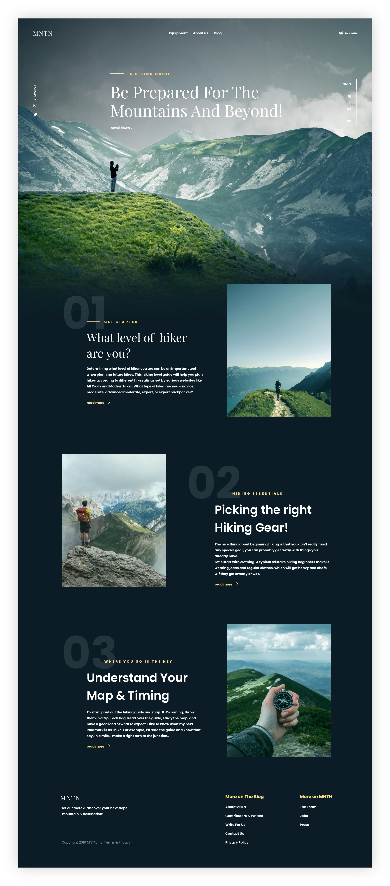

## Сайт, MNTN

Это одностраничный сайт сделан по макету из [figma](https://www.figma.com/design/EYKgZvtO2cVud0mwhPK5mm/Модуль5?node-id=8301-18&t=sqEKXmYOkcxanA2q-0)/[Pixso](https://pixso.net/app/editor/9RHiMH8Fb0zUB_WOWlydjQ?icon_type=1&page-id=0%3A1&item-id=1%3A2), резиновая адаптивная верстка.

> #### Стек технологий:
> HTML5, CSS3, JavaScript

